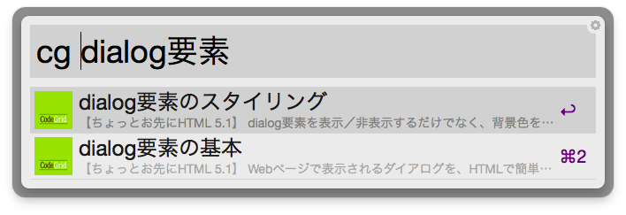

CodeGrid Suggest for [Alfred 2](http://www.alfredapp.com/)
========================

[CodeGrid](https://app.codegrid.net/)の記事を全文検索できるAlfredのワークフローです。

## インストール

以前のバージョンの「CodeGrid検索」を削除してからお使いください。

[CodeGrid Suggest.alfredworkflow](https://github.com/pxgrid/alfred-codegrid-workflow/releases/download/1.0/CodeGrid-Suggest.alfredworkflow)をダウンロードし、ダブルクリックするとAlfredに追加されます。  
※ワークフローを利用するためには、Powerpackが必要です。

## コマンド

### cg 検索したいキーワード

[CodeGrid](https://app.codegrid.net/)内の全ての記事から、任意のキーワードで検索することができます。  
アルファベットの大文字小文字は区別しません  

## ご利用上の注意

本ワークフローは、ベータ版です。利用しているAPIの変更などにより、動かなくなる可能性があります。
